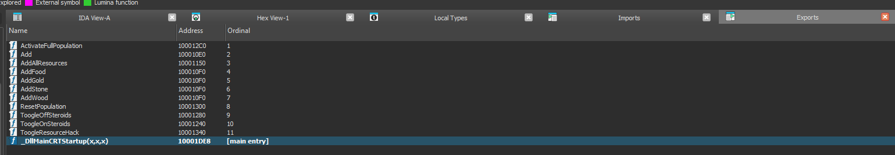

# Description
Reverse Engineering And Create Cheat for Age Of Empiresx: Rise of Rome using Internal Cheat

Game: [https://drive.google.com/file/d/1ZMkLpNDD7IBv4YrNMFRMx8gqCtR5C4I1/view?usp=sharing]

# Deofuscate Strings in Game binary 
- These are cheat code strings found in the binary  
```python
python3 Deofuscate.py
```

# DLL Injection technique
- Using DLL Injection to inject a DLL into target process. This a common technique use by malware for defense evasion but today i will use it for cheating 

## What is a DLL ? 
- DLL is a encapsulate executable or i would describe it as a "fast food" type of executeable. It can't be execute on it own and have to be loaded in another process.
- An DLL will contains many functions, you can see these function in export table of a DLL. These functions later can be used by another process that load a DLL and ANY DLL can be load by ANY Process (Must be same architech), that why i call it "fast food", because any process that load an DLL can use its function, it like go to the supermarket and buy something. 

# How to run
- First you must build it and remember build it in 32 bit executable otherwise it will not run cause Age of Empiresx is 32 bit executable 

## Build Injector
- This program will act as an injector, the main purpose of this is to run, inject DLL into target process and quit.
- To build this, goto injector folder and chose `Injector.sln`

```
cd Injector
```

- Next press `Ctrl + SHIFT + B` OR look at top left conner and click build -> Build Solution  
- The output exe file will be in **`/Injector/Debug/Injector.exe`**
- Verify it's a 32-bit exe 

## Build DLL 
- This is a main payload which will contain the actual cheat. For now, i haven't finished with the cheat engine, only appears message box when you type F1 -> F12 keys. 
- To build this, goto DLL-1 folder and chose **`DLL-1.sln`**

```
cd DLL-1
```
- Do the same above unless this time, the output DLL will be in `DLL-1\Release`
- Copy the `DLL-1.dll` into `/Injector/Debug/Injector.exe`, change filename to `cheat-32bit.dll` and run the `Injector.exe` 


## Functionality
Use hotket F2, F6, F7, F8, F9 
- F2: Toogle steroids: Increase the building speed of all buildings, units, and researches
- F6: Increase the amount of food, wood, gold, and stone by 10000 
- F7: Set Population LIMIT to 200 
- F8: Set Population to 0 (Unlimited Population)
- F9: Increase resource when spending 

Update: 
- Export function to be able to call from external program


```
TODO: 
- No Fog and Reveal Map cheat 
- Function Detour to hook message box to display cheat after pressing F1 -> F12 keys
- ASM code to hijack others player's resources
```

## On-going Research 

- Found an array of ALL our player current object (unit, building, resource) in the game memory, be able to modify it to our advantage but not yet found a way to create a cheat with it.
- Found a function that display message box, trying to hook it and display our message box.
- Sound affect of Game is stored in a .wav file, trying to replace it with our own sound affect.


# Remember 
- The game **MUST** already run to be able to inject 
- In short: run the game first and run the `injector.exe` and the DLL and exe must be in the same folder.

